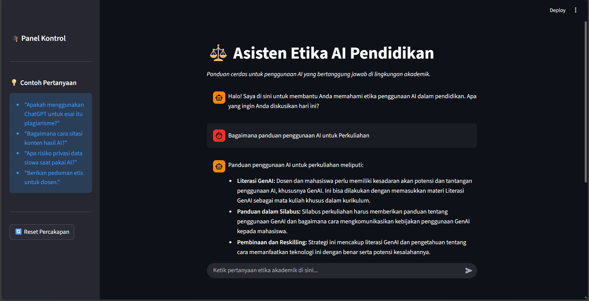
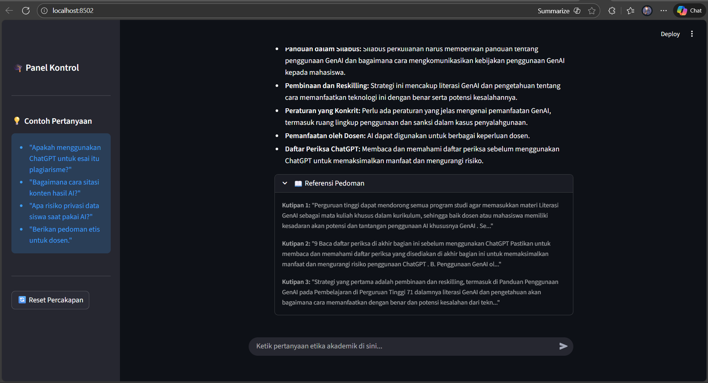

Asisten Etika AI di Pendidikan

Hasil Apps

## Pipeline Apps
1. Ekstrak
Dokumen knowledge di ekstrak lalu di chunk

2. Embed
Hasil chunk lalu di embed menggunakan Model All-mini-LM-l6-v2

3. Store
Hasil embed di simpan untuk knowledge base LLM

4. Retrieve
LLM akan diberi konteks dari hasil query user ke knowledge Base